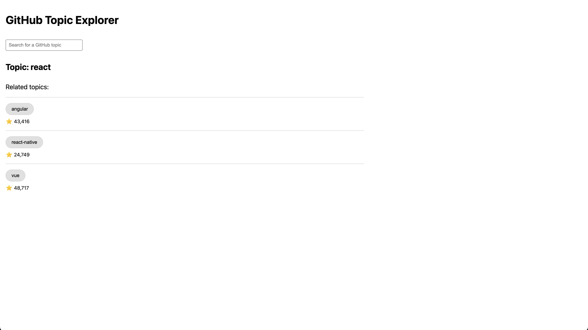
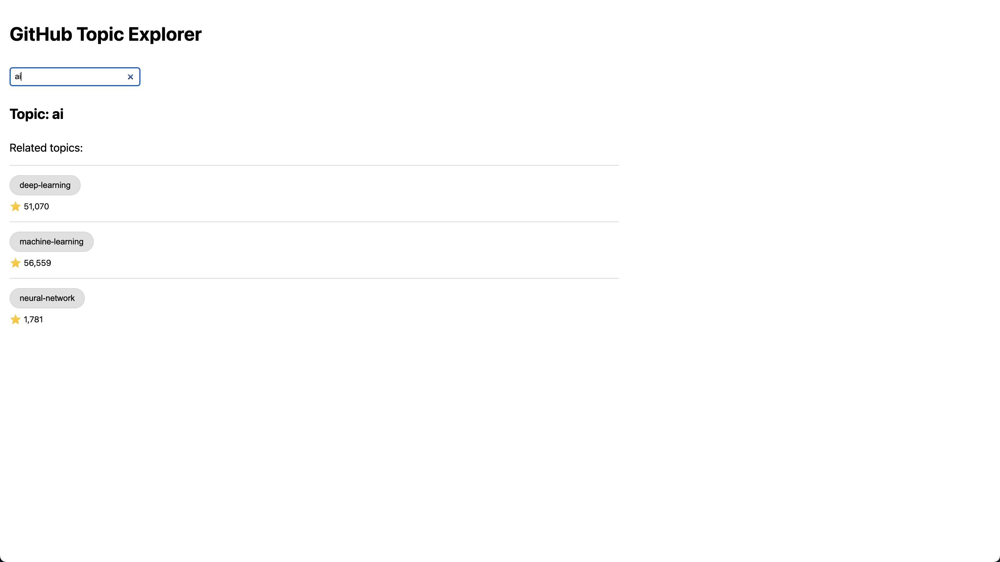

## Welcome to the GitHub Topic Explorer!

The GitHub Topic Explorer is a web application where you can search for and discover GitHub topics. Search for a term using the search bar and view a list of related topics and the number of stargazers for each of those related topics. You can also click on the name of a related topic to see related topics for that topic. By default the page displays results for the topic 'react'.

## Technologies used

- [Next.js](https://nextjs.org/)
- React (functional components and hooks)
- TypeScript
- CSS modules
- [Apollo GraphQL](https://www.apollographql.com/) (client and hooks)
- [GitHub GraphQL API](https://docs.github.com/en/graphql/guides/forming-calls-with-graphql#the-graphql-endpoint)
- [Jest](https://jestjs.io/)
- [React Test Renderer](https://reactjs.org/docs/test-renderer.html)
- [Lodash](https://lodash.com/)
- ES Lint
- Babel

This is a Next.js project bootstrapped with [`create-next-app`](https://github.com/vercel/next.js/tree/canary/packages/create-next-app). Create Next App was used to create the initial web application scaffold, which by default came with Next.js, React, CSS modules, and technologies such as ESLint. Next.js was chosen as the framework to build a React application because it comes with easy-to-use built-in page routing, as well as more flexible options for configuration and improving performance, which could be helpful if the application is extended or scaled in the future. When installing Create Next App, the option to add Next.js' TypeScript support was included since TypeScript allows for more strongly typing JavaScript, which can reduce bugs and make it easier to read and maintain code.

The Apollo GraphQL Client was used to fetch and cache data about GitHub topics from the GitHub GraphQL API. The cache management helps to reduce the number of API network calls needed. The Apollo [useLazyQuery](https://www.apollographql.com/docs/react/data/queries/#manual-execution-with-uselazyquery) hook was harnessed to make queries for a topic on mount (to display the results for the topic 'react' by default') and once changes to the search input are debounced. Unlike Apollo's useQuery hook, useLazyQuery returns a callback function to make a query, which makes it easier to make a query in more specific circumstances, such as in response to debounced input change events.

Lodash's debounce util was used to debounce a user's search input -- to wait until a user is likely done entering a search term before querying for new search results to minimize the number of API calls made.

Jest was used to write unit tests for the core functional requirements. A few babel presets and plugins were also added to what comes by default with the Next.js app in order to run the Jest tests on React components with TypeScript and JSX.

To support web accessibility, semantic HTML elements (JSX) were used where possible for each feature. To provide additional screen reader support, the `aria-label` attribute was added to the input element, and a label element was added above the input for a screen reader to first read (although it the element is visually hidden in the UI for aesthetic purposes). Elements were also styled with significant color contrast. A user can use a keyboard instead of a mouse for all of the core functionalities of the application.

## How to run the app

1. Clone this repository

2. To authenticate with the GitHub GraphQL server:

- create a personal access token with the scopes specified in the [GitHub API docs](https://docs.github.com/en/graphql/guides/forming-calls-with-graphql#authenticating-with-graphql).
- Pass the key you created to the `authorization` header of the Apollo Client instance created in the file `apollo-client.js`.

3. From the root of the project, install all dependencies

```bash
npm i
# or
yarn
```

4. Run the development server

```bash
npm run dev
# or
yarn dev
```

5. Open [http://localhost:3000/topic](http://localhost:3000/topic) with your browser to run the app.

Note: This application is also accessible and can be navigated by tabbing through elements on the page. If using Safari on a Mac, please first enable keyboard accessibility support [https://dequeuniversity.com/mac/keyboard-access-mac](https://dequeuniversity.com/mac/keyboard-access-mac))

## How to test the app

To run unit tests:

```bash
npm run test
# or
yarn test
```

To run TypeScript type checks:

```bash
npm run tsc
# or
yarn tsc
```

## Future improvements

In the future, additional improvements could be made, such as:

Code structuring / refactoring:

- If additional features were to be added to the application that also used a list and input, once confirming the product and design requirements, create global reusable components for a list, basic input, and search input (or use a third party library). Save these in a new directory in the project root or consider creating a separate UI library project for these to import into the web application.
- If more APIs need to be accessed via GraphQL in the future, reorganize the project in a way that will create a GraphQL API gateway that can query multiple data sources, so each data source will fetch data from the relevant API. This project was set up to demo simply querying one GitHub GraphQL API. In the future if this project is scaled, adding resolver functions to handle manipulating more complex data before returning it to the UI.
- Create global types file for commonly used TypeScript types.

Additional features:

- Display more background information about the main topic.
- Display the most starred GitHub repositories related to a topic or related topic.
- Replace the simple loading message with progressive loading indicators, so for example each list row shows a gray rectangle for the content loading, so the user can see more of the list items that should be loading.
- Enhance API error handling by replacing the simple error alert message with a nicer looking modal or error page to improve the user ex
- Add a query parameter for the search term to the page URL, so a user could navigate to a version of the explore topics page by query parameter and on page load see results for that specific term
- Replace default clear search button that comes with the default input element with a clear search button that can be focused and selected via tabbing on a keyboard (currently the default behavior doesn't allow this so a user has to manually delete the search text entered)
- Improve the visual design and styling. This project was created with a rudimentary design to focus on showcasing the functional and architectural aspects of the project.

## Screenshots




